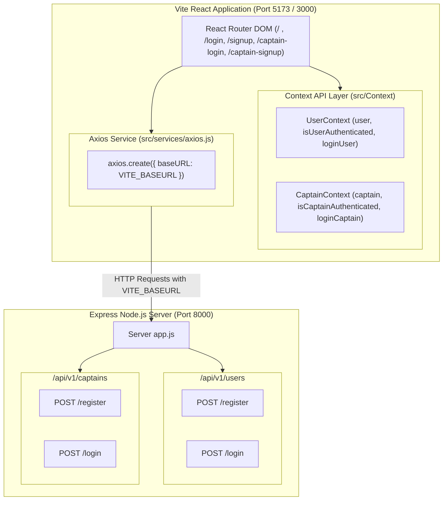

# PrimeRide - Urban Mobility Platform

This documentation provides an end-to-end walkthrough of the **PrimeRide** frontend routes (built with Vite, React, and TailwindCSS), state management powered by **React Context API**, and backend integration with the **Express REST API** via **Axios**.

---

## 🏗️ System Architecture & Data Flow



---

## ⚙️ Environment & Axios Configuration

### 1. Environment Variable (`.env`)
The client app uses `import.meta.env.VITE_BASEURL` to construct all server requests dynamically:
```env
VITE_BASEURL = "http://localhost:8000"
```

### 2. Axios Central Instance (`src/services/axios.js`)
All HTTP requests route through a pre-configured Axios instance enabling credentials and CORS handling:
```javascript
import axios from 'axios';

const baseURL = import.meta.env.VITE_BASEURL || 'http://localhost:8000';

const axiosInstance = axios.create({
  baseURL,
  withCredentials: true,
  headers: {
    'Content-Type': 'application/json',
  },
});

export default axiosInstance;
```

---

## 🌐 Routes & Express API Breakdown

Below is the detailed walkthrough of each application route, the inputs collected, validation rules, Context API updates, and the exact Express backend endpoint called.

---

### 1. Home Page (`/`)
- **Component**: `Home.jsx`
- **Purpose**: Landing page presenting the PrimeRide brand, active session indicators, and entry point to authentication.
- **Context API Consumed**: `useUser()` & `useCaptain()`
- **Features**:
  - Displays dynamic greeting (`Welcome back, Rider!` or `Welcome back, Captain!`) if context contains active credentials.
  - Quick logout control directly from the header status badge.
  - Touch-optimized CTA button leading to `/login`.

---

### 2. User Login Page (`/login`)
- **Component**: `UserLogni.jsx`
- **Purpose**: Authenticates existing riders into PrimeRide.

#### 📋 Collected Form Inputs & Validation Rules
| Input Field | Type | Client Validation Rule | Error Popup Behavior |
| :--- | :--- | :--- | :--- |
| **`Username`** | Text | Required (non-empty) | Red error badge pops up right above input |
| **`Email Address`** | Email | Required, Valid email pattern (`\S+@\S+\.\S+`) | Red error badge pops up right above input |
| **`Password`** | Password | Required, Min 6 characters | Red error badge pops up right above input |

#### 📡 Express API Call
- **Endpoint**: `POST ${VITE_BASEURL}/api/v1/users/login`
- **Request Payload**:
  ```json
  {
    "EmailId": "alex.rider@primeride.com",
    "password": "SecurePassword123!"
  }
  ```
- **Success Response Handling**:
  1. Stores returned user data & JWT token inside `UserContext` via `loginUser(response.data.data.user)`.
  2. Displays Pop-Up Modal: **`Login Success Full!`**.

---

### 3. User SignUp Page (`/signup`)
- **Component**: `UserSignup.jsx`
- **Purpose**: Registers a new rider account.

#### 📋 Collected Form Inputs & Validation Rules
| Input Field | Type | Client & Server Validation Rule | Error Popup Behavior |
| :--- | :--- | :--- | :--- |
| **`FirstName`** | Text | Required, Min 3 characters | Inline badge above field |
| **`LastName`** | Text | Required, Min 3 characters | Inline badge above field |
| **`EmailId`** | Email | Required, Valid email format | Inline badge above field |
| **`PhoneNumber`**| Tel | Required, Min 10 digits | Inline badge above field |
| **`password`** | Password | Required, Min 6 characters | Inline badge above field |

#### 📡 Express API Call
- **Endpoint**: `POST ${VITE_BASEURL}/api/v1/users/register`
- **Request Payload**:
  ```json
  {
    "FirstName": "Alex",
    "LastName": "Rider",
    "EmailId": "alex.rider@primeride.com",
    "PhoneNumber": "+19876543210",
    "password": "SecurePassword123!"
  }
  ```
- **Success Response Handling**:
  1. Stores newly created user profile inside `UserContext`.
  2. Displays Pop-Up Modal: **`SignUp Successful`**.
  3. Clicking **"Go to Login"** triggers automatic navigation to `/login`.

---

### 4. Captain Login Page (`/captain-login`)
- **Component**: `CaptionLogin.jsx`
- **Purpose**: Driver/Captain authentication portal.

#### 📋 Collected Form Inputs & Validation Rules
| Input Field | Type | Client Validation Rule | Error Popup Behavior |
| :--- | :--- | :--- | :--- |
| **`Username`** | Text | Required (non-empty) | Red badge pops up right above input |
| **`Email Address`** | Email | Required, Valid email format | Red badge pops up right above input |
| **`Password`** | Password | Required, Min 6 characters | Red badge pops up right above input |

#### 📡 Express API Call
- **Endpoint**: `POST ${VITE_BASEURL}/api/v1/captains/login`
- **Request Payload**:
  ```json
  {
    "Email": "captain.jack@primeride.com",
    "Password": "CaptainSecurePass2026!"
  }
  ```
- **Success Response Handling**:
  1. Stores returned captain profile inside `CaptainContext` via `loginCaptain(response.data.data.captain)`.
  2. Displays Pop-Up Modal: **`Login Success Full!`**.

---

### 5. Captain SignUp Page (`/captain-signup`)
- **Component**: `CaptionSignin.jsx`
- **Purpose**: Onboards new drivers with personal and vehicle registration details.

#### 📋 Collected Form Inputs & Validation Rules
| Section | Input Field | Type / Control | Validation Rule |
| :--- | :--- | :--- | :--- |
| **Personal Details** | `FirstName` | Text | Required, Min 3 characters |
| | `LastName` | Text | Required, Min 3 characters |
| | `EmailId` | Email | Required, Valid email |
| | `PhoneNumber` | Tel | Required, Min 10 digits |
| | `Password` | Password | Required, Min 6 characters |
| **Vehicle Specs** | `VehicleType` | Select Dropdown (`"bike"`, `"car"`, `"auto"`) | Required selection |
| | `Regrestration_Num`| Text | Required (e.g. `MH-12-AB-3456`) |
| | `Color` | Text | Required (e.g. `Black`) |
| | `Capacity` | Number | Required, Positive integer (>= 1) |

#### 📡 Express API Call
- **Endpoint**: `POST ${VITE_BASEURL}/api/v1/captains/register`
- **Request Payload**:
  ```json
  {
    "First_Name": "Jack",
    "Last_Name": "Sparrow",
    "Gender": "male",
    "Number": "+19876543210",
    "Email": "jack.sparrow@primeride.com",
    "Password": "CaptainPassword2026!",
    "Regrestration_Num": "MH-12-AB-3456",
    "Color": "Midnight Black",
    "Capacity": 4,
    "VehicleType": "car"
  }
  ```
- **Success Response Handling**:
  1. Stores full captain & vehicle specification inside `CaptainContext`.
  2. Displays Pop-Up Modal: **`SignUp Successful`**.
  3. Clicking **"Go to Captain Login"** redirects to `/captain-login`.

---

## ⚡ React Context API Architecture

State management is centralized in `src/Context`:

1. **`UserContext.jsx`**:
   ```javascript
   const { user, isUserAuthenticated, loginUser, logoutUser } = useUser();
   ```
2. **`CaptainContext.jsx`**:
   ```javascript
   const { captain, isCaptainAuthenticated, loginCaptain, logoutCaptain } = useCaptain();
   ```

Both context providers encapsulate the React Router DOM tree in `main.jsx`:
```jsx
<UserContextProvider>
  <CaptainContextProvider>
    <BrowserRouter>
      <App />
    </BrowserRouter>
  </CaptainContextProvider>
</UserContextProvider>
```
